# Bases de Dados

## 1 - Sistemas de Bases de Dados

**Base de Dados - **coleção organizada de dados que estão relacionados e que podem ser partilhados por múltiplas aplicações

**SGBD - **"is a general purpose software system that facilitates the processes of defining, constructing, manipulating, and sharing databases among various users and applications"

### Modelos de Base de Dados

**Modelo de BD - **coleção de conceitos para descrição lógica de dados

**Esquema - **descrição de um conjunto particular de dados com recurso a um determinado modelo

O **Modelo Relacional** é um dos mais utilizados nos dias de hoje

#### Modelo Hierárquico

- Dados armazenados numa estrutura hierárquica em árvore
- Os nós da árvore designam-se como registos que estão ligados por ponteiros
- Um registo é composto por um conjunto de atributos

##### Desvantagens

- Acesso sequencial de dados. Passa sempre pelo segmento da raiz.
- Redundância de informação
- Restrições de integridade. Eliminação de um segmento pai, implica a remoção de todos os segmentos filhos associados
- Não permite estabelecer associações N:M

#### Modelo em Rede

- Extensão do modelo hierárquico
- Permite que um mesmo registo esteja envolvido em várias associações
- Melhor capacidade de navegação
- Relações representadas através de grafos


## 2 - Desenho de Bases de Dados

**Análise de Requisitos - **Levantamento detalhado de toda a informação associada ao "problema"

**Desenho Conceptual - **Mapeamento das entidades e relações do mundo real para conceitos de base de dados. Visão abstrata da estrutura de base de dados que suportará os dados reais

### Modelo Entidade Relação

**Entidades - **algo que existe. Pessoa, Carro, Filme

**Atributos - **propriedades das entidades. Pessoa tem nome, Carro tem matrícula, Filme tem título

**Relações - **entre duas ou mais entidades

### Diagrama Entidade Relação

**Entidade - **representada por um retângulo

**Atributo - **representados por figuras ovais

#### Notação

- Entidade pode ter uma ou mais chaves. Os nomes desses atributos aparecem a **sublinhado**

#### Entidades

- **Fortes - **não dependem de outras entidades
- **Fracas - **dependem de outras entidades

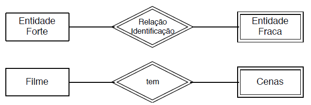

#### Atributos

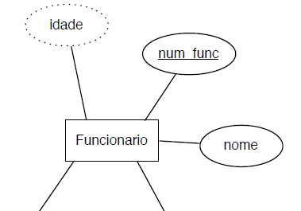 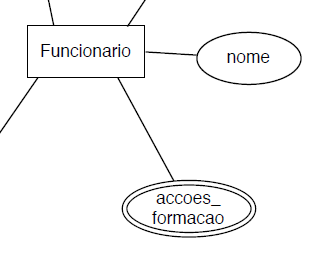 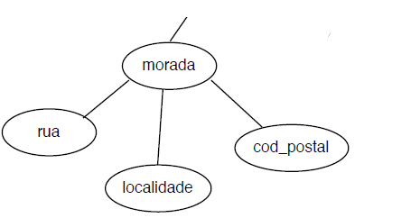

- **Derivados - **idade
- **Multivalor - **accoes_formacao
- **Compostos - **morada

#### Relações

Interações entre 2 ou mais entidades


### Classificação de Relações

#### Grau

Número de entidades participantes na relação

- **Unária - **Uma entidade
- **Binária - **Duas entidades
- **Ternária - **Três entidades
- **Múltiplas - **Duas entidades com mais que 1 relação entre si
- **Recursivas - **Unárias. É necessário indicar os papéis

#### Obrigatoriedade

**Participação Total (obrigatório) - **cada instância da entidade participa em pelo menos uma relação do conjunto de relações (linha dupla)

**Participação Parcial (opcional) - **algumas instâncias da entidade podem não participar em qualquer relação do conjunto de relações

#### Notação (min,max)

**Mínimo**

- Se **"0"**, é **opcional** a participação da entidade na relação
- Se **"1"**, é **obrigatória** a participação da entidade na relação

**Máximo**

- Se **"1"**, cada instância da entidade está, no máximo, associada a uma única instância da relação
- Se **"N"**, cada instância da entidade está associada a várias instâncias da relação

#### Cardinalidade

- **Relação 1:1 - **Um funcionário gere um departamento e um departamento só tem um gestor
- **Relação 1:N - **Um funcionário trabalha para um só departamento. Um departamento tem um ou mais funcionários.
- **Relação N:M - **Um funcionário pode trabalhar em um ou mais projetos. Um projeto tem um ou mais funcionários a trabalhar nele

#### Relações de Integridade 

Invariantes que a base de dados deve garantir

##### Atributos

- Cada atributo só tem um valor
- Atributos chave são únicos
- Atributo (deve / pode)  ter um valor
- Valor do atributo pode ter restrições (>, <, !=, not null, etc)

### Agregação

Às vezes temos necessidade de modelar uma relação entre uma entidade e outra relação envolvendo outras entidades.

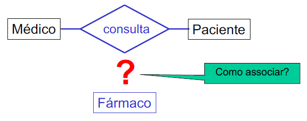 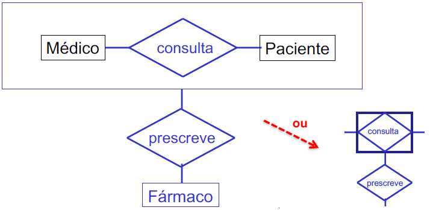

**Entidade Associativa - **Permite associar entidades a relacionamentos

### Generalização vs Especialização

Classificação de entidades em hierarquia de classes. As sub-entidades herdam os atributos das super-entidades

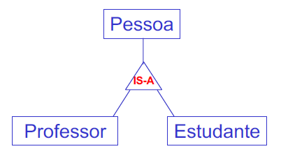

#### Restrição de Sobreposição

- **Disjuntas - **uma entidade só pode pertencer, no máximo, a uma subclasse de especialização (disjoint)
  - A entidade genérica é especializada, no máximo, por **uma** das suas especializações
- **Sobrepostas - **uma ocorrência de entidade genérica pode ter mais de uma especialização
  - A entidade genérica pode ser especializada por **várias** sub-entidades

#### Restrição de Completude

- **Total - **uma entidade de nível superior tem de pertencer a pelo menos uma subclasse de especialização (linha dupla)
- **Parcial - **pode não pertencer a nenhuma

> Ver exemplos da Clínica Médica e Empresa


## 3 - Modelo Relacional

Base do Modelo Relacional - **Relação**

**Atributo**

- Representam o tipo de dados a armazenar
- O número de atributo de uma relação define o **grau da relação**
- Os atributos de uma relação devem ter nomes distintos

**Domínio**

- Tipo de dados
- Gama de valores possíveis para determinado **atributo**. Sexo {'M', 'F'}. Cidade {Porto, Aveiro}
- Valores desconhecidos ou não existentes

**Esquema de Relação**

- Nome do esquema e lista de atributos. Pessoa (nome, bi, idade)

##### Relação

- Estrutura bidimensional com determinado esquema e zero ou mais instâncias (tuplos)

**Tuplo**

- Linha de uma relação. t = <v1, v2, ..., vn>
- Devem ser distintos
- A ordem das linhas é indiferente
- O número de tuplos define a **cardinalidade da relação**

**Atomicidade**

- O valor de um **atributo** num tuplo é **atómico** (não é composto/multi-valor)

**Esquema da Base de Dados**

- Conjunto de todos os esquemas da relação da BD

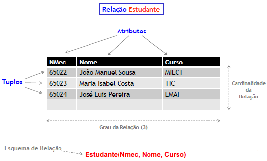

### Chaves

**Superchave - ** conjunto de atributos que identificam de forma única os tuplos da relação

**Chave Candidata - **subconjunto de atributos de uma superchave que não pode ser reduzido sem perder essa qualidade de superchave

**Chave Primária - **chave principal selecionada de entre as chaves candidatas

**Chave Única - **chave candidata não eleita como primária

**Chave Estrangeira - ** conjunto de um ou mais atributos que é chave primária noutra relação

#### Chave Primária

- A escolha da **chave primária** (de entre as candidatas) é arbitrária
- As chaves candidatas não eleitas designam-se como **chaves únicas**
- A chave primária **não pode** ter valor NULL
- Critério de escolha da chave primária
  - Elemento "natural" de identificação. Valor raramente alterado

### Restrições de Integridade

São regras que visam garantir a integridade dos dados

- **Domínio - **dos atributos. forma mais elementar de integridade. Os campos devem obedecer ao tipo de dados e às restrições de valores admitidos para um atributo
- **Entidade - **cada tuplo deve ser identificado de forma única com recurso a uma **chave primária** que **não se repete** e não pode ser null
- **Referencial - **o valor de uma **chave entrangeira** ou é null ou contém um valor que é **chave primária** na relação de onde foi importada

### DER para Esquema Relacional

#### **Entidade Regular**

- Criar uma tabela com todos os seus atributos. 
- Incluir os atributos compostos como elementos singulares
- Selecionar uma das chaves como primária

#### **Entidade Fraca**

- Tabela que inclui os seus atributos assim como a chave primária da entidade dominante
- Atributos compostos como elementos singulares
- A chave primária é a combinação de chave primária do dominante e a própria chave parcial

#### **Relação 1:1 - **entre S e T

- Escolher uma das relações (S) e incluir como chave estrangeira, a chave primária da outra relação
- Incluir em S os eventuais atributos de relacionamento
- Escolher como S uma relação com participação total

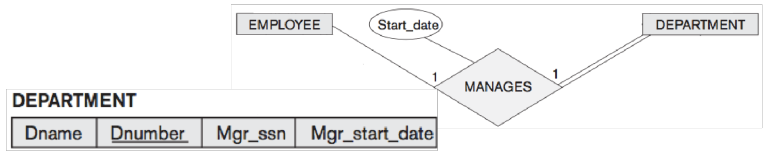

#### **Relação 1:N - ** entre S e T

- Escolher como S a relação que representa a entidade do lado N e como e como T a que representa a entidade do lado 1
- Incluir em S, como chave estrangeira, a chave primária da relação T
- Incluir os atributos do relacionamento em S

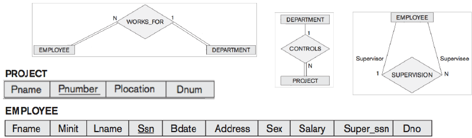

#### Relação N:M - entre S e T

- Criar uma nova tabela
- Incluir como chave estrangeiro as chaves primárias das entidades que participam na relação. Estas chaves combinadas formarão a chave primária da relação R
- Incluir os atributos do relacionamento na relação


#### Atributo Multi-valor

- Criar uma nova tabela
- Incluir um atributo correspondendo ao atributo multi-valor
- Incluir a chave primária da entidade que tem o atributo
- A chave primária da nova relação é a combinação dos 2 anteriores

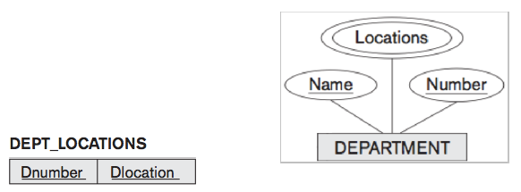

#### Relação n-ária

- Criar uma nova tabela
- Incluir como chaves estrangeiras, as chaves primárias das entidades participantes
- Incluir os eventuais atributos do relacionamento
- A chave primária é a combinação das chaves entrangeiras

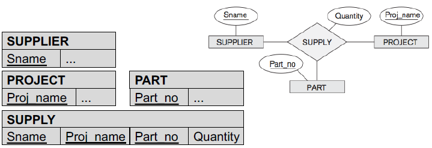

#### Especialização

##### Método 1

- Criar uma tabela para a entidade de maior nível
- Criar uma tabela para cada entidade de nível inferior. Incluir em cada uma destas relações a chave primária de C e os atributos locais

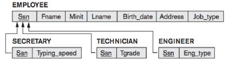

##### Método 2

- Criar uma tabela para cada entidade de nível inferior. Incluir os atributos da superclasse e os atributos locais

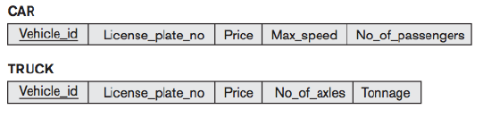

- Só funciona com especialização total
- Só se recomenda em especializações disjuntas. Nas sobrepostas há duplicado de informação

#### Resumo

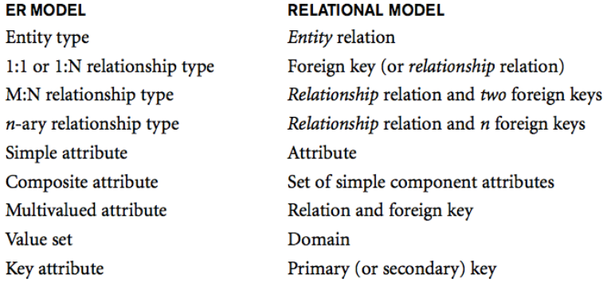

#### Exemplo

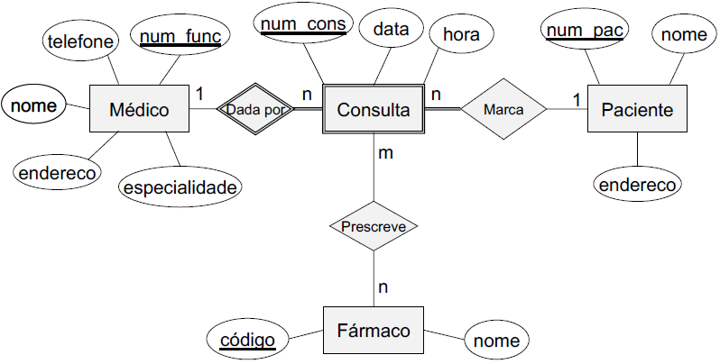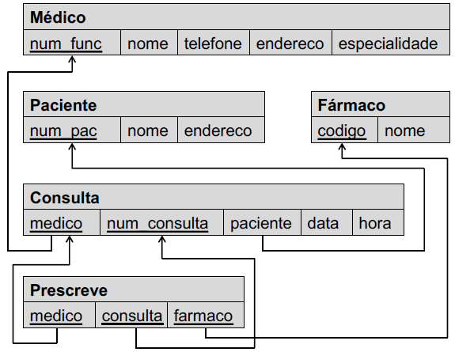


## 4 - SQL - Data Definition Language

Utiliza **tabela**, **linha** e **coluna** para designar **relação**, **tuplo** e **atributo**

### Criar e Eliminar uma BD

```sql
CREATE DATABASE dbname;
DROP DATABASE dbname;
```

> Schema é um "namespace" que agrupa tabelas e outros elementos pertencentes à mesma aplicação

### Tipos de Dados

- **char(n) - **cadeia de caracteres de tamanho fixo n
- **varchar(n) - **cadeia de caracteres com tamanho máximo n
- **int - **números inteiros (4 bytes)
- **date** e **time - **data e hora
- **boolean - **valores booleanos

### Definição de Domínio

Permite criar novos tipos de dados

```sql
CREATE DOMAIN compsalary INTEGER
	   NOT NULL CHECK (compsalary > 475);
	   
CREATE TABLE EMPOYEE (
	...
	Salary			compsalary
	...);
```

### Definição de Novo Tipo

Podemos criar só um novo tipo (alias) com o comando **create type**

```sql
CREATE TYPE SSN FROM varchar(9) NOT NULL;

CREATE TABLE EMPLOYEE (
	...
	Ssn				SSN
	...);
```

#### Valores por Omissão

Podem ser definidos valores por omissão para cada coluna. Utilizando o termo DEFAULT

### Restrições de Integridade

- **check (P) - **impor uma regra a um atributo. Aplicada sempre que um tuplo é introduzido ou modificado
- **not null - **atributo não pode ser null
- **primary key (A1, ..., An) - **definir chave primária. Só podemos definir uma chave primária na tabela
- **unique (A1, ..., An) - **chaves candidatas não primária. Utilizada para as chaves candidatas alternativas
- **foreign key - **definir chave estrangeira. Deve referencia uma chave primária ou única

##### As restrições podem ser de:

- **Coluna - ** referem-se a apenas uma coluna e são descritas em frente à coluna
- **Tabela - **referem-se a mais do que a uma coluna e ficam separadas da definição das colunas

### Foreign Key

**Integridade Referencial - **Pode haver uma violação quando são inseridos ou eliminados tuplos ou quando os atributos chave estrangeira ou primária são modificados, resultando numa rejeição da operação

Definir ações alternativas **"on delete"** e **"on update"**, com as seguintes opções:

- **restrict -** não deixar efetuar a operação
- **cascade -** apaga os registos associados (delete) ou altera a chave estrangeira (update)
- **set null - **a chave estrangeira passa a null
- **set default - **a chave estrangeira passa a ter o valor por omissão

Se quisermos alterar uma restrição de uma tabela, podemos batizar a restrição com nome próprio

```sql
CONSTRAINT EMPK
	PRIMARY KEY (Ssn)
```

### Alter Table

Utilizado para modificar o esquema da tabela ou restrições existentes

```sql
ALTER TABLE EMPLOYEE ADD nofiscal INT; 		-- Adicionar atributos à tabela
ALTER TABLE EMPLOYEE DROP COLUMN nofiscal; 	-- Eliminar atributos da tabela
ALTER TABLE EMPLOYEE ADD CONSTRAINT salarymin CHECK (Slry > 475); -- Adicionar restrições
ALTER TABLE EMPLOYEE DROP CONSTRAINT salarymin; 				  -- Eliminar restrições
```


## 5 - Algebra Relacional

### Seleção

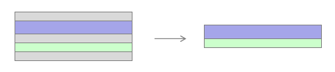

**Notação - ** σ<selection condition>(R)

- Selecionar um subconjunto de tuplos da relação que satisfazem os critérios de seleção 
- O resultado é uma nova relação que tem um esquema igual à original

**Comparação - ** Permitem comparar dois atributos ou um atributo com um valor

**Condições Booleanas - **Utilização de AND, OR e NOT

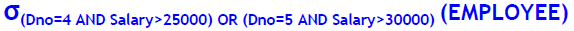

### Projeção


**Notação - ** π<attribute list>(R)

- O resultado é uma nova relação só com os K atributos selecionados
- São removidas as linhas duplicadas do resultado

### Renomeação

**Notação - **ρR2(B1, B2, ..., Bn)(R1)  ou  ρR2(R1)  ou  ρ(B1, B2, ..., Bn)(R1)

- No primeiro caso o resultado é um nova relação R2 com os atributos renomeados (B1, B2, ..., Bn)
- No segundo caso só renomeamos a relação
- No terceiro só renomeamos os atributos

### Produto Cartesiano

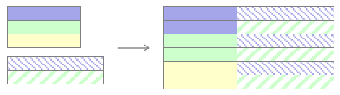

- Permite-nos combinar tuplos de relações diferentes.
- O resultado é uma nova relação que combina cada elemento (tuplo) de uma relação com um elemento (tuplo) da outra relação

### Natural Join

- Operação de junta um produto cartesiano seguido de uma seleção com condição.
- Atributos repetidos são removidos

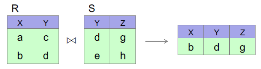

### Operações Extendidas - Joins

#### Semi Join

- Nhe

#### Outer join

- **Left Outer Join - **R ⟕ S

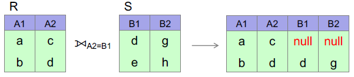

- **Rigth Outer Join - **R ⟖ S

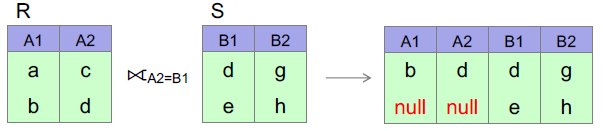

- **Full Outer Join - **Join: R ⟗ S

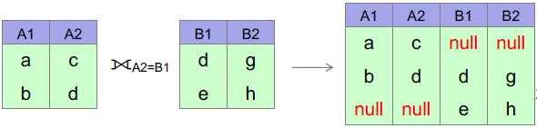

### Agregação

**Notação - **<grouping attributes> F <function list> (R)

- Operações sobre vários tuplos da relação. (avg, min, max, sum, count)

#### Exemplo

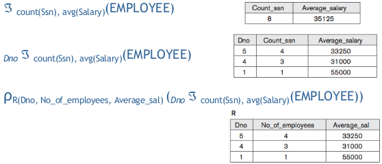


## 6 - SQL - Data Manipulation Language

### Inserção

- Sintaxe 1

```sql
INSERT INTO EMPLOYEE VALUES
	(‘Richard’,‘K’,‘Marini’,‘653298653’,NULL,‘98
	 Oak Forest, Katy, TX’, ‘M’, 37000, ‘653298653’, 4);
```

- Sintaxe 2

```sql
INSERT INTO EMPLOYEE (Dno, Fname, Lname, Ssn) VALUES
	(4, ‘Richard’, ‘Marini’, ‘653298653’);
```

### Eliminação 

```sql
-- remoção (potencial) de um tuplo:
DELETE FROM EMPLOYEE WHERE Ssn=‘123456789’;
-- remoção (potencial) de n tuplos:
DELETE FROM EMPLOYEE WHERE Dno > 5 AND Dno < 8;
-- remoção de todos os tuplos da relação:
DELETE FROM EMPLOYEE;
```

### Actualização

```sql
-- atualiza um tuplo:
UPDATE		PROJECT
SET			Plocation = ‘Bellaire’, Dnum = 5
WHERE		Pnumber=10;
-- atualização (potencial) de n tuplos:
UPDATE 		EMPLOYEE
SET			Salary = Salary * 1.1
WHERE		Dno = 5;
```

### Projeção

- Selecionar um conjunto de atributos (colunas)

```sql
SELECT * FROM EMPLOYEE; 			-- Todas as colunas
SELECT Fname, Ssn FROM EMPLOYEE; 	-- Duas colunas
```

- Podemos selecionar todos os tuplos (ALL) ou eliminar os duplicados (DISTINCT)

### Seleção

- Selecoinar um subconjunto de tuplos da tabela

```sql
SELECT Bdate, Address FROM EMPLOYEE
WHERE Fname=‘John’ AND Minit=‘B’ AND Lname=‘Smith’;
```

### Renomeação

```sql
-- Renomear Tabela
SELECT E.Fname, E.Ssn FROM EMPLOYEE AS E;
SELECT E.Fname AS Fn, E.Ssn AS Ssname FROM EMPLOYEE AS E;
-- Renomear Atributo
SELECT Dno AS DepNumber FROM EMPLOYEE;
-- Renomear Resultado de Operação Aritmética
SELECT Salary * 0.35 AS SalaryTaxes FROM EMPLOYEE;
```

**Reunião - **UNION

**Intersecção - **INTERSECT

**Diferença - **EXCEPT

### Produto Cartesiano

```sql
-- Exemplo de Produto Cartesiano
SELECT * FROM EMPLOYEE, DEPARTMENT;
```

### Junção de Relações

- Junção de 2 relações

```sql
-- Exemplo de “select-project-join query”
SELECT Fname, Lname, Address
FROM EMPLOYEE, DEPARTMENT
WHERE Dname=‘Research’ AND Dnumber=Dno;
```

- Junção de 3 relações

```sql
SELECT Pnumber, Dnum, Lname, Address, Bdate
FROM EMPLOYEE, DEPARTMENT, PROJECT
WHERE Dnum=Dnumber AND Mgr_ssn=Ssn AND Plocation=‘Stafford’;
```

- Quando exsitem nomes de atributos iguais em distintas relações da junção, podemos utilizar o full qualified name
  - relation_name.attribute

### Ordenação de Resultados

```sql
SELECT		D.Dname, E.Lname, E.Fname, P.Pname
FROM		DEPARTMENT AS D, EMPLOYEE AS E, WORKS_ON AS W, PROJECT AS P
WHERE		D.Dnumber= E.Dno AND E.Ssn= W.Essn AND W.Pno= P.Pnumber
ORDER BY	D.Dname, E.Lname DESC, E.Fname;
```

### Junções

#### JOIN ON

```sql
-- exemplo de Equi-join:
SELECT		Fname, Lname, Address
FROM		(EMPLOYEE JOIN DEPARTMENT ON Dno=Dnumber)
WHERE		Dname=‘Research’;
```

#### OUTER JOIN

```sql
-- exemplo de Outer Join com renomeação das relações e atributos
SELECT E.Lname AS Employee_name, S.Lname AS Supervisor_name
FROM (EMPLOYEE AS E LEFT OUTER JOIN EMPLOYEE AS S
	  ON E.Super_ssn=S.Ssn);
```

#### Encadeamento

```sql
SELECT		Pnumber, Dnum, Lname, Address, Bdate
FROM		((PROJECT JOIN DEPARTMENT ON Dnum=Dnumber) JOIN EMPLOYEE ON Mgr_ssn=Ssn)
WHERE		Plocation=‘Stafford’;
```

### Agregações

```sql
/* Exemplo 1: obter o valor total, o máximo, o mínimo e o valor médio */
SELECT 	SUM (Salary), MAX (Salary), MIN (Salary), AVG (Salary)
FROM 	EMPLOYEE;
/* Exemplo 2: No de funcionários do departamento ‘Research’ */
SELECT 	COUNT (*)
FROM	EMPLOYEE JOIN DEPARTMENT ON DNO=DNUMBER
WHERE	DNAME=‘Research’;
/* Exemplo 3: No de vencimentos distintos */
SELECT	COUNT (DISTINCT Salary)
FROM	EMPLOYEE;
```

#### GROUP BY

```sql
/* Exemplo 1: para cada departamento, obter o seu número, o
número de funcionários e a sua média salarial */
SELECT		Dno, COUNT(*), AVG(Salary)
FROM 		EMPLOYEE
GROUP BY 	Dno
/* Exemplo 2: agregação com junção de duas relações */
SELECT 		Pnumber, Pname, COUNT(*)
FROM		PROJECT JOIN WORKS_ON ON Pnumber=Pno
GROUP BY 	Pnumber, Pname;
```

#### GROUP BY ... HAVING

```sql
/* Exemplo 1: Para cada projeto, com mais de dois funcionários, obter o seu nome e no de funcionários que trabalham no projeto */
SELECT 		Pname, COUNT(*)
FROM		PROJECT join WORKS_ON ON Pnumber=Pno
GROUP BY 	Pname
HAVING		COUNT(*) > 2;
```

#### Resumo

```sql
SELECT		A1,..,An, FAgr1,..Fagrh
FROM		R1,R2,..,Rm
WHERE		<condition_W>
GROUP BY	A1,..,An
HAVING		<condition_H>;
```

### SubConsultas

- Utilizar o resultado de um query noutra query
- Podem aparecer na clausula FROM e WHERE

#### FROM

```sql
SELECT 		Fname, Minit, Lname, Ssn
FROM		Employee JOIN ( SELECT	Essn
							FROM	DEPENDENT
							GROUP BY Essn
							HAVING	count(Essn)>2) AS Dep
			ON Ssn=Dep.Essn;
```

#### WHERE

```
SELECT		Fname, Minit, Lname
FROM		EMPLOYEE
WHERE		Ssn NOT IN (SELECT Essn FROM DEPENDENT);
```

#### Comparação de Conjuntos

Existem operadores que podem ser utilizados para comparar um valor simples com um set ou multiset

##### ANY e ALL

```sql
/* Exemplo 1: Obter o nome dos funcionários cujo salário é maior do que o salário de todos os trabalhadores do departamento 5 */
SELECT	Lname, Fname
FROM	EMPLOYEE
WHERE	Salary > ALL ( 	SELECT 	Salary
						FROM	EMPLOYEE
						WHERE	Dno=5);
/* Exemplo 2: Obter o nome dos funcionários cujo salário é
maior do que o salário de algum trabalhador do departamento 5 */
SELECT	Lname, Fname
FROM	EMPLOYEE
WHERE	Salary > ANY ( 	SELECT 	Salary
						FROM	EMPLOYEE
						WHERE	Dno=5);
```

#### Subconsultas Não Correlacionadas

- A subquery não depende de dados que lhe são fornecidos pela query exterior
  - Neste caso a query interior é executada uma única vez e o resultado é utilizado no SELECT exterior

#### Subconsultas Correlacionadas

- A subquery depende de dados que lhe são fornecidos pela query exterior
  - Neste caso a query interior é executada uma vez para cada resultado do SELECT exterior


## 7 - SQL - View

- **Relação virtual** - Derivada de relações base. São vistas sobre dados detidos por tabelas reais.
- **Utilização - **Apresentação de dados. Adaptação do esquema de base de dados a diferentes aplicações

### Criação 

```sql
--  Exemplo1: Uma vista com o nome dos funcionários, projectos em que trabalham e número de horas. */
CREATE VIEW EMPLOYEE_PROJECTS AS
            SELECT Fname, Lname, Pname, Hours
            FROM EMPLOYEE JOIN WORKS_ON ON Ssn=Essn
            JOIN PROJECT ON Pno=Pnumber;
-- Exemplo2: Vista com nome do departamento, número de funcionários e total de salários
CREATE VIEW DEPT_INFO(Dept_name, No_of_emps, Total_sal) AS
            SELECT Dname, Count(*), Sum(Salary)
            FROM EMPLOYEE JOIN DEPARTMENT ON Dno=Dnumber
            GROUP BY Dname;
```

- Uma view pode ser utilizada como fonte de dados (como uma tabela normal)  num conjunto de operações SQL já identificadas (SELECT, INSERT, UPDATE, DELETE)
  - **Query modification - ** transformação da query
  - **View materialization - **criação de uma tabela temporária com resultados da execução da view, sobre a qual serão executadas as operações SQL pretendidas
- **Nested views - **views com fonte de dados de outras views

### Update de Dados

- Pode ser muito complexa em função da complexidade da própria view
- Uma view é **updatable** se incluir **uma só tabela base** na sua definição e os seguintes atributos: primary key e todos os NOT NULL sem default value
- **Não é updatable** se utilizar **várias tabelas** base (uso do **join**) ou utilizarem agrupamentos de atributos e funções de agregação

### Check Option

- Utiliza-se no final da definição da View se quisermos garantir que as condições da cláusula WHERE são verificadas na atualização

```sql
/* Exemplo: Vista com os funcionários do dapartamento 5*/
CREATE VIEW EMPLOYEE_DEP5 AS
            SELECT Fname, Lname, Ssn, Dno
            FROM EMPLOYEE
            WHERE Dno=5
            WITH CHECK OPTION;
/* Inserir dados utilizando a vista */
INSERT INTO EMPLOYEE_DEP5 VALUES(‘Jose’, ‘Sousa’, 312312323, 8)
-- A operação acima só dará erro se utilizarmos WITH CHECK OPTION
```


## 8 - Normalização

- **Preservação da informação**
  - Todos os conceitos capturados pelo desenho conceptual que são mais tarde mapeados para o desenho lógico
- **Minimizar a redundância dos dados**
  - Minimizar o armazenamento duplicado de dados em relações distintas, reduzindo a necessidade de múltiplos updates e consequente problema de consistência entre múltiplas cópias da mesma informação

### Critérios Informais

#### Clareza da semântica dos atributos da relação

- O desenho de um esquema de relação deve ser fácil de explicar
- Verificar se existe uma semântica clara entre os atributos de uma relação

#### Redundância de Informação no Tuplo

- Reduzir ao máximo o espaço ocupado por uma relação

#### Redução dos NULLs nos tuplos

- Há situações em que temos uma grande quantidade de atributos numa relação. Muitos dos atributos não se aplicam a todos os tuplos da relação.
- Existêm muitos NULLs nesses tuplos
  - Desperdício de espaço
  - Difícil interpretação do seu sentido desses atributos
- **Recomendação - **Criar outra relação para esses atributos

#### Junção de Relações baseada em PK e FK

- Devemos evitar esquemas de relação que estabelecem relacionamentos entre duas relações baseadas em atributos que não a chave primária ou estrangeira

### Critérios Formais

#### Dependências Funcionais

- Permite descrever restrições dos atributos que os tuplos devem respeitar em todo o momento
- Permite detetar e descrever problemas com precisão

Uma DF é uma propriedade do esquema de relação R que não pode ser inferido de uma qualquer instância de R. Deve ser definida por alguém que conhece a semântica dos atributos da relação.

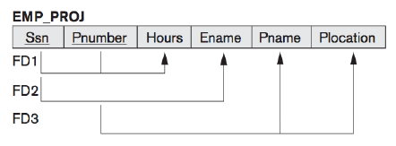

- Ssn -> Ename
  - O Ssn determina de forma única o nome dos funcionários
- Pnumber -> {Pname, Plocation}
  - O número do projeto determina de forma única o seu nome e localização
- {Ssn, Pnumber} -> Hours
  - O Ssn e o número do projeto determinam de forma única o número de horas que um funcionário trabalha para o projeto

##### **Tipos de Dependências Funcionais**

- **Dependência Parcial**
  - atributo depende de parte dos atributos que compõem a chave da relação
- **Dependência Total**
  - atributo depende de toda a chave da relação
- **Dependência Transitiva**
  - atributo que não faz parte da chave da relação, depende de um atributo que também não faz parte da chave da relação

### Normalização

**Objetivo - **reduzir a redundância

Utilizámos DF para especificar alguns aspetos semânticos do esquema da relação

**Assumimos que : **

- Existe um conjunto de DF associadas a cada esquema da relação
- Que cada relação tem uma chave primária definida

#### **Processo de Normalização**

O processo de normalização consiste em efetuar um conjunto de testes para certificar se um desenho de BD relacional satisfaz determinada Forma Normal. Relações que não satisfazem os testes de determinada forma normal são decompostas em relações menores.

#### Primeira Forma Normal (1NF)

- Atributos são atómicos (simples e indivisíveis). Não permite atributos composto ou **multivalor**.
- Não suporta relações dentro de relações. Não é possível utilizar uma relação como valor de um atributo de um tuplo.

- **Converter**
  - Atributos multivalor -> Decomposição da relação (+ tabelas)
  - Nested relation -> Decompor a relação

#### Segunda Forma Normal (2NF)

- A relação está na 1FN e todos os atributos não pertencentes a qualquer chave candidate devem depender totalmente da chave e **não de parte dela**. Não existem dependências parciais
- **Converter - **Decompor a relação. Nas dependências **parciais**.

#### Terceira Forma Normal (3NF)

- A relação está na 2FN e não existem dependências funcionais entre atributos não chave. Não existem dependências **transitivas**.
- **Converter - **Decompor a relação. Nas dependências transitivas.

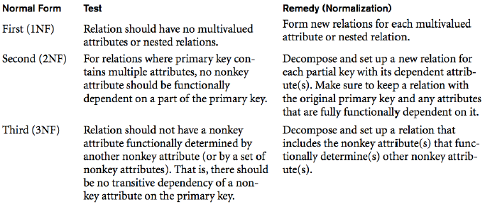

#### Boyce-Codd Normal Form (BCNF)

Usualmente, a 3FN é aquela que termina o processo de normalização.

BCNF é mais restritiva que a 3FN

**Definição - **Todos os atributos são funcionalmente dependentes da chave da relação, de toda a chave e de nada mais.

#### Ponto de Equilíbrio


## 9 - Indexação e Optimização

- Índices são **estruturas de dados** que oferecem uma segunda forma (rápida) de acesso aos dados
  - Melhora o tempo de consulta
  - Pode aumentar o volume de dados armazenado e o tempo das inserções
- É possível 
  - Indexar qualquer atributo da relação
  - Criar múltiplos índices (sobre atributos distintos)
  - Criar índices com vários atributos
- Atributos indexados denominam-se por **Index Key**

### Organização física dos dados

Índices são **estruturas** que:

- Têm um valor ordenado (atributo indexado)
- Um ponteiro para a sua localização
  - **Não denso** - Início da página
  - **Denso** - Offset do próprio tuplo na página

Os índices também são guardados em páginas

### Single-Level Ordered

- São estruturas de um **único nível** que indexam um atributo da relação
  - Armazena cada **valor** do atributos indexado e a respetiva **localização** da relação (ponteiro para a estrutura física que suporta a tabela)
  - Índices são ordenados o que permite pesquisa binária sobre o atributo
- Permite uma **pesquisa binária** com boa complexidade


- **Primary Index - ** Indexa um **atributo** chave da **relação** (não se repete)
- **Clustered Index - **Indexa um **atributo** que pode ter valores duplicados. Os atributos estão **agrupados**
- **Secondary Index - **Indexa **outros atributos**. Podemos ter **vários** índices deste tipo.

### Multi-Level

- Tem vários níveis de indexação. Estes indíces são tipicamente implementados com estruturas em árvore balanceadas. **B-Tree**.

### SQL - Index

```sql
-- Criar um índice para o atributo Pname
CREATE INDEX idxPName ON Project(Pname);
-- Criar um índice multi-atributo
CREATE INDEX idxEmpName ON Employee(Fname, Minit, Lname)
-- Eliminar índice idxPName
DROP INDEX idxPName;
```

Índice multi-atributo justifica-se se efetuarmos pesquisas contendo os atributos do Key Index (Fname, Minit, Lname)

### Seleção de Índices

- Criação deve ser criteriosa pois existem mais e menos valias
  - Um índice pode **acelerar** o processo de pesquisa de um valor num atributo (ou gama de valores) e junções envolvendo esse atributo
  - Um índice introduz **overhead** ao nível do volume de dados e do tempo de inserção, atualização e eliminação de tuplos
- A escolha deve ser um compromisso entre
  - Perceber se vamos ter necessidade de efetuar muitas pesquisas envolvendo determinado atributo
  - Perceber se determinada relação vai ter modificações frequentes de dados

#### Critérios Genéricos

- Indexação das **chaves da relação**
  - Pesquisamos frequentemente por atributos chave da relação
  - Sendo a chave única, ou existe tuplo ou não
- Se o índice **não é chave da relação** podemos ter (ou não) ganhos no tempo de pesquisa. Há **duas situações recomendadas**
  - O atributo indexado tem **poucos valores repetidos.**
  - A relação tem o atributo indexado do tipo clustered. Clustering  é agrupar os valores desse atributo de forma a que ocupem o menor número de páginas

### SQL Server - Indexing

2 tipos de índices 

- **Clustered** 
  - Os nós folha contêm os próprios dados da relação
  - A tabela está ordenada pelo próprio índice
    - Só existe **um por relação**
- **Non-clustered **
  - Os índices apontam para a tabela base
  - Podemos ter vários numa relação

#### B-Tree Page Split

- Os índices da B-Tree devem manter-se ordenados pelo key index
- Inserts, updates e deletes afetam os dados

Quando pretendemos fazer um insert e a página está cheia

- O SGBD divide a página cheia em duas (**page split**)
  - cria uma nova página
  - copia parte dos índices para a nova página
  - reflete esta nova realidade nos nós hierarquicamente superiores
  - insere o novo índice

O processo de page split é particularmente penalizador em termos de desempenho temporal

### Opções de Especialização

#### Unique

- A index key é única (não tem valores duplicados)
- Por defeito, a criação de uma **chave primária** cira automaticamente um **unique clustered index**

#### Composite

- Índice com vários atributos
- A ordem dos atributos importa
  - Um índice só  é considerado como podendo ser usado se a primeira coluna faz parte da query

#### Filtered

- Permite utilização da cláusula WHERE no CREATE INDEX
- Só disponível para non-clustered index
- Só indexamos parte dos tuplos da relação

#### Inclusão de atributos num Índice

- Podemos incluir non-key atributos nas filhas de um índice non-clustered
- Chamadas query "cobertas". Query em que todos os dados de que a query necessita estão no índice

### SQL Server Indexes

```sql
-- Clustered Index
CREATE CLUSTERED INDEX IxOrderID ON OrderDetail(OrderID);
-- Clustered Composite Index
CREATE CLUSTERED INDEX IxGuideName ON Guide (LastName, FirstName);
-- Clustered UNIQUE Index
CREATE UNIQUE CLUSTERED INDEX IxGuideName ON Guide (LastName,
FirstName);
-- FILTERED Index
CREATE INDEX IxActiveProduction ON Production.WorkOrders
(WorkOrderID, ProductID) WHERE Status = ‘Active’;
-- Non-clusteres with column include
CREATE INDEX ixGuideCovering ON dbo.Guide (LastName, FirstName)
INCLUDE (Title);
```

- Uma **heap table** insere os novos registos no final da tabela
- Uma **clustered table** introduz o novo registo na B-Tree segundo a ordem da cluster index key

O desempenho dos uma solução clustered table está muito associado à ocorrência de page splits no processo de inserção

#### Escolha de um Clustered Index

- Verificar se a criação, por defeito, de um "unique clustered index" para a chave primária é boa opção
- "Evitar" chaves susceptíveis de criar "page split"
- Chaves pequenas são preferíveis

#### Escolha de um Non-Clustered Index

- São utilizados para optimizar os tempos das consultas
- Atributos sobre os quais são efectuadas consultas ordenadas

#### B-Tree Tuning

Minimizar os Page Splits

Index **fill factor** e **pad index**

- Um índice necessita de ter um pouco mais espaço livre em cada página para evitar que novas entradas obriguem a page split
- Fill factor permite definir a % de espaço livre
- Pad index indica se só aplicamos o fill factor aos nós folhas (ou não) 

**Best practice**

- Utilizar fill factor próximo de **100%** se temos inserções **ordenadas**
- 65-85% se tivermos mais inserções no meio da B-Tree

#### Desfragmentação de Índices

Processo de eliminação de "espaços vazios" resultantes de page splits e remoção de tuplos

- Verificar o estado de fragmentação do índice
- Reconstruir o índice caso este esteja muito fragmentado
  - ALTER INDEX IndexName ON TableName REORGANIZE
  - Desfragmenta, ao nível das folhas, de acordo com o fill factor do ínidce
  - ou
  - ALTER INDEX ALL ON Frag REBUILD WITH (FILLFACTOR = 98)
  - Reconstrói o índice completamente (equivalemte a um DROP + CREATE)


## 10 - SQL Programming

### Batch

Grupo de uma ou mais instruções SQL que constituem uma unidade lógica. Um erro sintático numa instrução provoca a falha de toda a batch. Um erro de runtime não anula instruções SQL prévias.

Terminada a batch, são eliminadas todas as variáveis locais, tabelas temporárias e cursores criados

### Script

Ficheiro de texto contendo uma ou mais batches delimitadas por GO. As batches são executadas em sequência

### Variáveis

#### Declaração

- DECLARE @x varchar(10) = 'Ola'
- DECLARE @min_range int, @max_range int

#### Atribuição de um valor

- SET @x = 'Kabung'
- SET @min_range = 0, @max_range = 100

#### Atribuição de um valor numa instrução SELECT

- ​	SELECT @price = price FROM titles WHERE tittle_id = '123123'

#### PRINT

```sql
PRINT ‘ola’;
DECLARE @Temp int = 5;
PRINT ‘TEMP value: ’ + STR(@Temp);
```

### Instruções de Controlo de Fluxo

- **BEGIN ... END** - Define um bloco de instruções
- **IF ... ELSE** 

```SQL
IF (SELECT ytd_sales FROM titles WHERE title_id='PC1035') > 5000
	PRINT 'Year-to-date sales are greater than $5,000 for PC1035'
IF EXISTS(SELECT * FROM [ORDER] WHERE Closed = 0)
	BEGIN
		PRINT ‘Process Orders’;
		PRINT ‘BLA..BLA’;
	END
ELSE
	PRINT ‘BLE..BLE’;
```

- **WHILE**

```SQL
WHILE (SELECT AVG(royalty) FROM roysched) < 25
	BEGIN
		UPDATE roysched SET royalty = royalty * 1.05;
		IF (SELECT MAX(royalty) FROM roysched) > 27
			BREAK;
		ELSE
			CONTINUE;
	END;
```

- **CASE ... WHEN**

```SQL
SELECT OrderID, CustomerID ,
	EmployeeName =
    CASE EmployeeID
        WHEN 1 THEN 'Mario'
        WHEN 2 THEN 'Julio'
        WHEN 3 THEN 'Vasco'
        WHEN 4 THEN 'Sousa'
        WHEN 5 THEN 'Rui'
        ELSE 'desconhecido'
    END
FROM [Orders]
```

### Tabelas Temporárias Locais

São sinalizadas com o **carácter #** antes do nome. São criadas na base de dados tempdb.

Estão visíveis na sessão que as criou. No level em que são criados e todos os inner level.

São eliminadas quando o procedimento ou função termina.

### Tabelas Temporárias Globais

Utilizam **dois caracteres #** antes do nome

Similares à local mas têm um scope maior. Ficam visíveis para outras sessões. Apropriadas para a partilha de dados. São eliminadas quando a última sessão desconecta.

### Tabelas como Variáveis

Similares a tabelas temporárias locais mas têm um scope mais limitado. Tem o mesmo scope que as variáveis locais, mas **não estão visíveis em inner levels da call stack.**

Desaparecem quando a batch, procedimento ou função, onde foram criadas, chegam ao fim.

### Cursor

Ferramenta que permite percorrer sequencialmente os tuplos retornados por determinada consulta (SELECT)

Tipicamente temos duas abordagens:

- Set based query
- Cursor operation

Soluções **set-based** são, em geral, bastante **mais rápidas**

#### 5 Steps

```sql
-- Declaração
DECLARE CursorName CURSOR [CursorOptions]
FOR Select Statement;
-- Open to retrieve data
OPEN CursorName;
-- Moves to the next row and assigns the values from each column returned by the cursor into a local variable */
FETCH [Direction] CursorName [INTO @Variable1, @Variable2, ...];
-- Close cursos
CLOSE CursorName;
-- Release cursor.
DEALLOCATE CursorName;
```

### Stored Procedures

Trata-se de uma **batch armazenada** com um nome.

O SQL Server **não tem de recompilar o código** cada vez que o procedimento é invocado.

Os procedimentos são guardados em **memória cache** na primeira vez em que são executados

O procedimento pode

- Ter parâmetros de entrada
- Ter valor de retorno (parâmetros de saída, return success ou failure status messages)
- Devolver um conjunto de registos

#### Create

```sql
CREATE PROC GroupLeader_Members @Emp_Code varchar(10) = null
AS
    IF @Emp_Code is null
    BEGIN
        PRINT 'Please enter Employee Code!'
        RETURN
    END
    SELECT * FROM Employees
    WHERE EMP_EMP_ID = (SELECT EMP_ID FROM Employees
    					WHERE Emp_Code = @Emp_Code)
    ORDER BY Emp_Name
```

#### Tipos

**System **stored procedure

- Nome começa com sp_
- Podem ser utilizados em qualquer base de dados

**Local** stored procedure

- São definidos num base de dados local
- Nome livre mas recomenda-se uma normalização por parte do utilizador

#### Execução

```sql
-- Sem parâmetros de entrada
EXEC dbo.CategoryList;
-- Com um parâmetros de entrada
EXEC Department_Members ‘Accounting’;
-- Com múltiplos parâmetros de entrada
-- ... por posição
EXEC pr_GetTopProducts 1, 10
-- ... por nome (ordem não interessa)
EXEC GetTopProducts @EndID = 10, @StartID = 1
```

**Parâmetros de Saída - **Devemos criar previamente a variável que receberá o valor de parâmetro de saída

```sql
-- Criação
CREATE PROC dbo.GetProductName (
				@ProductCode CHAR(10), @ProductName VARCHAR(25) OUTPUT)
AS
SELECT @ProductName = ProductName
FROM dbo.Product
WHERE Code = @ProductCode;
-- Utilização
DECLARE @ProdName VARCHAR(25);
EXEC dbo.GetProductName ‘1001’, @ProdName OUTPUT;
PRINT @ProdName;
```

**Return N - **Termina incondicionalmente o procedimentos e retorna um interio. O valor de saída pode ser atribuído a uma variável (EXCEC @LocalVariable = StoredProcedureName)

#### Try ... Catch

```sql
GO
CREATE PROCEDURE uspTryCatchTest
AS
BEGIN TRY
	SELECT 1/0
END TRY
BEGIN CATCH
    SELECT ERROR_NUMBER() AS ErrorNumber
    ,ERROR_SEVERITY() AS ErrorSeverity
    ,ERROR_STATE() AS ErrorState
    ,ERROR_PROCEDURE() AS ErrorProcedure
    ,ERROR_LINE() AS ErrorLine
    ,ERROR_MESSAGE() AS ErrorMessage;
END CATCH;
GO
EXEC uspTryCatchTest;
```

#### Mais Valias

- **Extensibility - **Using stored procedure is the best means of abstracting, ou decoupling, the database.

- **Performance - **Fastest possible SQL Server Code, it keeps the execution of data-centric code close to the data, and t's easier to index tune a database with stored procedures

- **Usability - **It's easier for application programmers to make a stored procedure call and consume the result than 

- **Data Integrity - **A stored procedure developed by the database developer is less likely to contain data integrity errors.

  **Security - **Locking down the tables and providing access anly through stored procedures is a standard best practice for database development.

### User Defined Functions

#### Vantagens

- Os mesmos benefícios dos Stored procedures (compilado e optimizados)
- Podem ser utilizados para incorporar lógica complexa dentro de uma consulta
- Os mesmos benefícios das vistas pois podem ser utilizados como **fonte de dados**. Acresce o facto de aceitar parâmetros.

#### UDF Escalar

- Aceitam múltiplos parâmetros
- Retornam um único valor
- Podem ser utilizados dentro de qualquer expressão T-SQL

```sql
CREATE FUNCTION dbo.fsMultiply (@A INT, @B INT = 3) RETURNS INT
AS
BEGIN
	RETURN @A * @B;
END;
GO
SELECT dbo.fsMultiply (3,4), dbo.fsMultiply (7, DEFAULT);
SELECT dbo.fsMultiply (3,4) * dbo.fsMultiply (7, DEFAULT);
```

##### Limitações

- **Determinísticas - **Os mesmos parâmetros de entrada produzem o mesmo valor de saída. Não são permitidas funções não-determinísticas dentro das UDF. newid(), rand(), etc
- Não são permitidos updates à base de dados ou invocação do comando DBCC
- Em termos de valor de retorno não permite mta coisa
- Não permite try ... catch
- Recursividade limitada a 32 níveis

#### UDF Inline Table-valued

- Similares a vistas
  - Wrapers para construções SELECT
  - Tem as mais valias das views + suportar parâmetros de entrada

```sql
CREATE FUNCTION dbo.AveragePricebyItems (@price money = 0.0) RETURNS Table
AS
	RETURN (SELECT Ite_Description, Ite_Price
					FROM Items
					WHERE Ite_Price > @price)
GO
SELECT * FROM dbo.AveragePricebyItems (15.00)
```

#### UDF Multi-statement Table-Valued

- Combina a capacidade das funções escalares (código complexo) com a capacidade das inline table-valued (retornar um conjunto)
- Cria uma table variable, introduz-lhe tuplos e retorna-a

```sql
CREATE FUNCTION dbo.AveragePricebyItems2 (@price money = 0.0) RETURNS @table TABLE
										(Description varchar(50) null, Price money null)
AS
	BEGIN
		INSERT @table SELECT Ite_Description, Ite_Price
        						FROM Items WHERE Ite_Price > @price;
	RETURN;
END;
GO
SELECT * FROM dbo.AveragePricebyItems2 (15.00);
```

#### Schema Binding

Schema binding previne a alteração ou eliminação de objectos utilizados pela função

### Trigger

Um tipo especial de stored procedure que é executado em determinadas circunstâncias associadas à manipulação de dados.

Quando ocorre uma das ações previstas, os triggers são "disparados"

**2 tipos - ** isntead of e after

#### Transactional Flow

- **AFTER** trigger pode assumir que os dados passaram todos as verificações de integridade de dados
- **AFTER** trigger ocorre depois de todos os constraints
- **AFTER** trigger ocorre antes do commit da transação DML. Assim podemos fazer o rollback da transação  se os dados forem inaceitáveis
- **INSTEAD OF** trigger - a transação para no ponto 4 e nenhum dos posteriores é executado, incluindo a instrução DML
- **INSTEAD OF** trigger pode "contornar" problemas de integridade referencial mas não os de nulidade, tipos de dados e identidade das colunas

#### After

- Podemos ter vários triggers after por tabela
- Utilizações possíveis
  - Processos complexos de validação de dados envolvendo várias tabelas
  - Assegurar regras de negócios complexas
  - Efetuar auditorias aos dados
  - Atualizar campos calculados

```sql
GO
CREATE Trigger highsales ON dbo.[Order Details]
AFTER INSERT, UPDATE
AS
	SET NOCOUNT ON;
	DECLARE @total as real
    SELECT @total = unitprice * (1-discount) * quantity FROM inserted;
    IF @total < 0.99
        BEGIN
            RAISERROR ('Encomenda nao processada. Valor muito baixo', 16,1);
            ROLLBACK TRAN; -- Anula a inserção
        END
    ELSE IF @total > 1000
  			PRINT 'Log: Encomenda de valor elevado'
GO
```

#### Instead of

- Apenas um por tabela
- Não é executada a ação associada (Insert, Update, Delete)
- Devemos utilizar este tipo de trigger quando sabemos que a ação (instrução DML) tem um elevada probabilidade de ser **rolled back** e pretendemos que outra lógica seja executada em vez (instead of) dela.

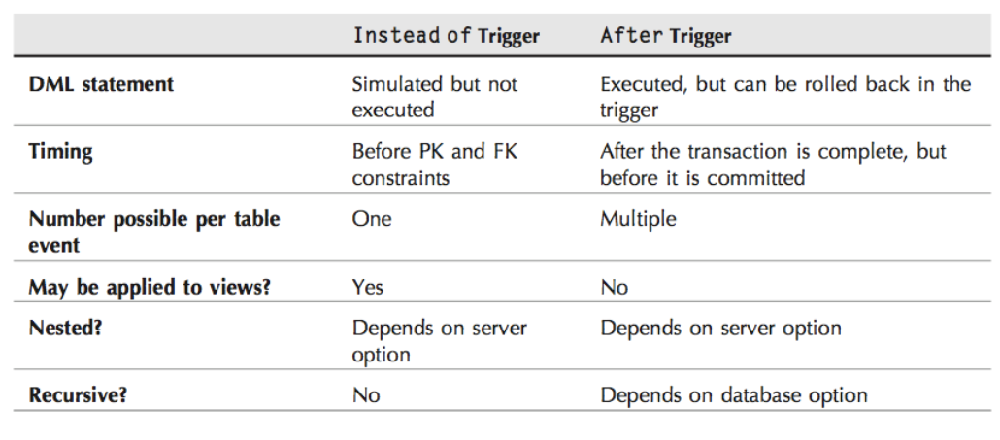

#### Logical Tables

O SQL Server permite ter acesso a duas tabelas lógicas com uma imagem read-only dos dados afetados

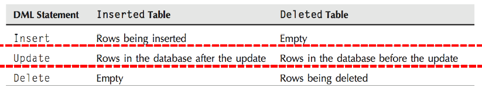


## 11 - Transações, Concorrência e Recuperação de Falhas

- Transação é uma unidade lógica de trabalho contendo uma ou mais operações

- Transação é um conjunto de operações de leitura e escrita sobre a base de dados
  - **read(x) - **transfere o elemento X da base de dados para a área de memória volátil associada à transação que executou a operação de leitura
  - **write(x) - **transfere o elemento X da área de memória afeta à transação para a base de dados

```sql
BEGIN TRANSACTION
UPDATE authors SET au_lname = upper(au_lname)
WHERE au_lname = 'White'
IF @@ROWCOUNT = 2
	COMMIT TRAN		-- Sucesso
ELSE
BEGIN
	PRINT 'A transaction needs to be rolled
	back'
	ROLLBACK TRAN	-- Insucesso
END
```

### Estados de uma Transação

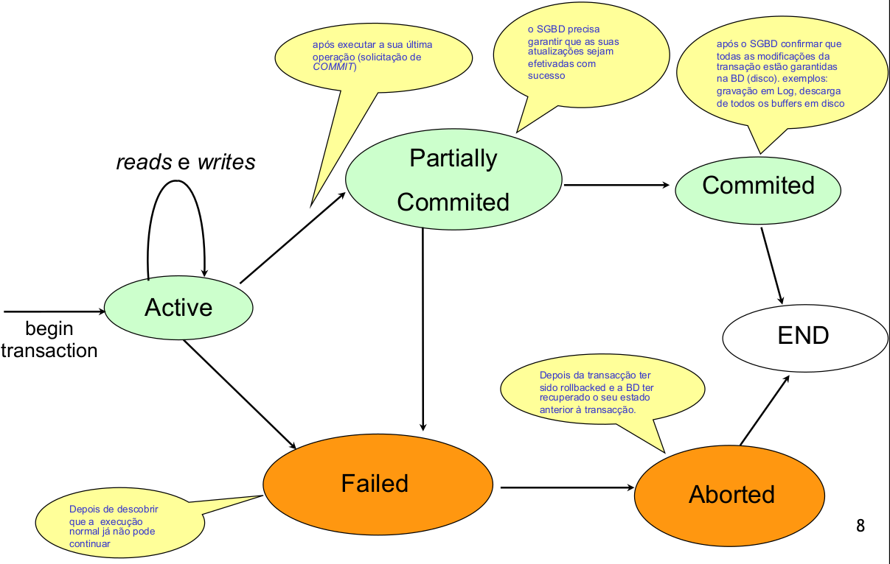

### Propriedades de uma Transação

**ACID - **(Atomicity, Consistency, Isolation, Durability)

- **Atomicidade - **as operações da transação ocorrem de forma indivisível
- **Consistência - **Após as operações o estado de integridade tem de se manter
- **Isolamento - **O sistema deve dar a cada transação a ilusão de ser única. As transações concorrentes não interferem entre si
- **Persistência - **os efeitos de uma transação terminada com um commit são permanentes e visíveis para outras transações

#### Atomicidade

Princípio do "Tudo ou Nada"

- Ou todas as operações da transação são efetivadas com sucesso na BD ou nenhuma delas se efetiva

É da responsabilidade do SGBD a recuperação de **falhas**, ou seja, desfazer as operações da transação parcialmente executadas.

#### Consistência

Uma transação deve transportar sempre a base de dados de um estado de integridade para outro estado de integridade. O programador da aplicação que codifica a transação tem a responsabilidade.

#### Isolamento

É desejável que as transações possam ser executadas de forma concorrente. A execução de uma transação deve ser realizada como se ela estivesse a ser executada de forma isolada. Garante que a execução simultânea das transações resulta num estado equivalente ao que seria obtido caso elas tivessem sido executadas em série. Recurso a técnicas de escalonamento.

#### Persistência

SGBD deve garantir que as modificações realizadas por uma transação concluída com sucesso persistem na base de dados.

### Controlo de Concorrência

**Escalonamento Serializado**

- Uma transação executada de cada vez, de forma sequencial. Solução bastante ineficiente. 

**Escalonamento Concorrente Serializado**

- Execução concorrente de transações mas de modo a preservar o isolamento. Nem todas as execuções concorrentes resultam num estado de integridade. O resultado final é um estado inconsistente.

#### Escalonador

- Entidade responsável pela definição de escalonamentos concorrente de transações.
- Um determinado escalonamento E define uma ordem de execução (intercalada) das operações de várias transações. A ordem das operações dentro de cada transação é preservada.

**Situações de conflito**

- Operações que pertencem a transações diferentes
- Transações acendendo ao mesmo elemento
- Pelo menos uma das operações é write

**Problema de Atualização Perdida** (lost-update)

- Uma transação T1 grava um dado que entretanto já tinha sido e utilizado na transação T2...

**Problema de Leitura Suja** (dirty-read)

- T1 atualiza um elemento A e, posteriormente, outras transações leem A
- No entanto T1 falha e as suas operações são desfeitas

#### Métodos de Controlo de Concorrência

- Mecanismos de locking
- Mecanismos de etiquetagem
- Métodos optimistas

Os dois primeiros são preventivos pois o objetivo é permitir a execução concorrente de transações até onde for possível e evitar operações que provoquem interferências entre transações.

O último é otimista porque parte do principio que as interferências são raras

##### Mecanismos de Etiquetagem

Quando a transação de inicia é-lhe atribuída uma etiqueta com um número sequencial de chegada ao sistema. Sempre que uma transação acede a um elemento (R ou W), marca-o com a sua etiqueta.

Quando uma transação tenta aceder a um elemento cujo valor da etiqueta é superior ao seu, a transação é desfeita e reiniciada com um novo número de etiqueta.

##### Mecanismos de Locking

Trata-se de um mecanismo muito conhecido/utilizado

**Lock** é uma variável associada a determinado elemento da base de dados que, de acordo com o seu valor no momentos, permite ou não ser acedido.

Locks são libertados no fim da transação (COMMIT ou ROLLBACK)

Obriga a implementação de regras que evitem problemas de deadlock

### Recuperação de Falhas

Falhas podem comprometer a integridade da BD. SGBD devem estar preparados para responder a falhas.

**Objetivo - **que o estado da BD recuperada esteja o mais próximo possível do momento que antecedeu a falha

#### Falhas de um SGBD

**Menos Graves - **falha numa transação

**Muito Graves - **perda total ou parcial da base de dados

**Mecanismos de Recuperação**

- Escalonamentos
- Backups
- Transaction logging

-----

Temos diferentes categorias de escalonamentos considerando o grau de cooperação num processo de recuperação de falhas de transações

**Escalonamento Recuperável - **Um escalonamento E diz-se recuperável se nenhuma transação em E for concluída (commited) até que todas as outras transações que escrevam elementos lidos por Ti tenham sido concluídas.

**Escalonamento sem Abort em Cascata - **Um escalonamento E é recuperável e evita aborts em cascata se uma transação em E só puder ler elementos que tenham sido atualizados por transações que já concluíram.

**Escalonamento Estrito - **Um escalonamento E é recuperável, evita aborts em cascata e é estrito se uma transação em E só puder ler ou atualizar um elemento A depois que todas as transações que atualizaram A tenham sido concluídas

**Backups - **Cópias de segurança efetuadas com regularidade que devem contemplar toda a base de dados. Ponto de recuperação caso existam falhas muito graves no sistema.

Só permite recuperar dados até ao momento em que foi efetuado o backup.

**Transaction Logs - **Um sistema de log que regista todas as operações realizadas nas transações da base de dados, incluindo o commit. Os logs também guardam uma imagem dos dados alterados.

- **Data Flow**
  - O log regista de forma sequencial todas as operações da transação, incluindo o commit
  - Só no final do registo do commit no log, os dados podem ser guardados em disco
  - Antes dos dados da BD serem escritos em disco, os respetivos dados do log têm de ser escritos

- **Recuperação de Falhas**
  - Podemos ter várias operações sobre dados efetuadas em memória volátil que podem não ser guardadas em disco caso ocorra uma falha no sistema
  - No entanto, o registo de logs já está em disco, pelo que pode ser utilizado para recuperação da falhas

**Recuperação de Falha de Disco**

- Existe uma falha nos discos em que está a base de dados. Caso mais grave de falha pois obriga à reconstrução de toda a base de dados
- **Processo**
  - Fazer o restore do ultimo backup
  - Fazer o rollforward

**Recuperação de Falha de Transação**

- Basta utilizar a before-image do transaction-logging capturada antes da transação para fazer rollback

**Recuperação de Falha de Sistema**

- Erros no SO ou no SGBD. Nestas condições considera-se que a base de dados está corrompida e é necessário regressar a um estado anterior válido utilizando
  - Rollback com as before-images do transaction-logging
  - Rollforward com as after-images do transaction-logging

#### Rollback

Até que ponto?

**Solução Segura - **Último backup

- Operação lenta. Pode ser um momento muito recuado o que obrigará a um grande esforço pois temos de refazer todos as transações até ao momento da falha

**Solução baseada em Checkpoint**

- Marca no transaction log que identifica o momento em que os buffers são escritos para disco
- Ponto de sincronismo entre o transaction log e a BD. São fundamentais para limitar a amplitude dos processos de rollback e rollforward

**Savepoint**

- Permite reconstruir a transação até esses pontos
- Savepoint é interno à transação


## 12 - Aspectos de Segurança

Utilizadores são identificados em primeira instância no servidor, depois na base de dados e finalmente nos objetos da BD.

Ao nível do servidor os utilizadores são reconhecidos pelo seu login.

Se o utilizador pertence ao grupo sysadmin, então tem acesso total as funcionalidades do servidor.

**Um login pode ter distintos users associados ... um por DB**

User com privilégio de acesso a uma BD tem um conjunto de permissões administrativas mas ... para aceder aos dados necessita que lhe sejam concedidas permissões para acesso a objetos da BD:

Todos os users pertencem automaticamente ao grupo public.

As permissões dos objetos são atribuidas com os comandos **grant**, **revoke** e **deny**.

#### DB - Grant Access

Grant DB Acess to Users. Um login pode ter associado um único user em cada DB cujo nome pode ser distinto entre DBs

### Segurança dos Objetos da DB

Podemos associar permissões a cada objeto, atribuídas:

- diretamente ao user
- uma rolo a que o user pertence

**Object Ownership**

- Podemos ter permissões para executar um SP mas não para os outros objetos acedidas por este

Schemas também têm owner e todos os seus objetos têm o mesmo owner

##### Revoke, Deny

Revonke e Deny têm sintaxes similares ao GRANT

Deny é a acção oposta oa Grant : remove explicitamente uma permissão. Que se sobrepõem a um eventual Grant "sobreposto"

Anulamos um Grant ou Deny com um Revoke

**Stored Procedure - **"execute as"

- Podemos determinar como será executado o código dentro do SP

**Cifragem de Atributos**

- Senha
- Chave Simétrica
- Chave Assimétrica
- Certificados Digitais

### SQL Injection

Injeção maliciosa de comandos SQL num SGBD através de uma aplicação. Ameaça mais comum num SGBD

```sql
SQLQuery = "SELECT * FROM Login where username= '" + form_usr + "' AND password = '" + form_pwd + "'";
```

Se o utilizador introduzir os seguintes campos

- form_id -> 3 or 1=1 --
- form_pin -> <anything>

A query resultante seria

```
SELECT * FROM customers WHERE id = 3 or 1=1 –– AND pin = anything
```

Que retorna todos os tuplos de customers...

#### Descobrir nome da tabela e atributos

Espetar lá group by "shit" e observar o nome dos atributos no erro

#### Como prevenir?

- Não confiar nos dados introduzidos pelo utilizador. **Validar** toda a entrada de dados.
- Nunca utilizar SQL dinâmico. Utilizar SQL **parametrizado** ou Stored Procedures.
- Nunca conectar a DB com uma conta administrador. Utilizar uma conta com **privilégios limitados**.
- Não armazenar informação sensível em texto simples. Utilizar processos de **cifragem** ou hash
- **Reduzir** ao mínimo a apresentação de informação de **erros**